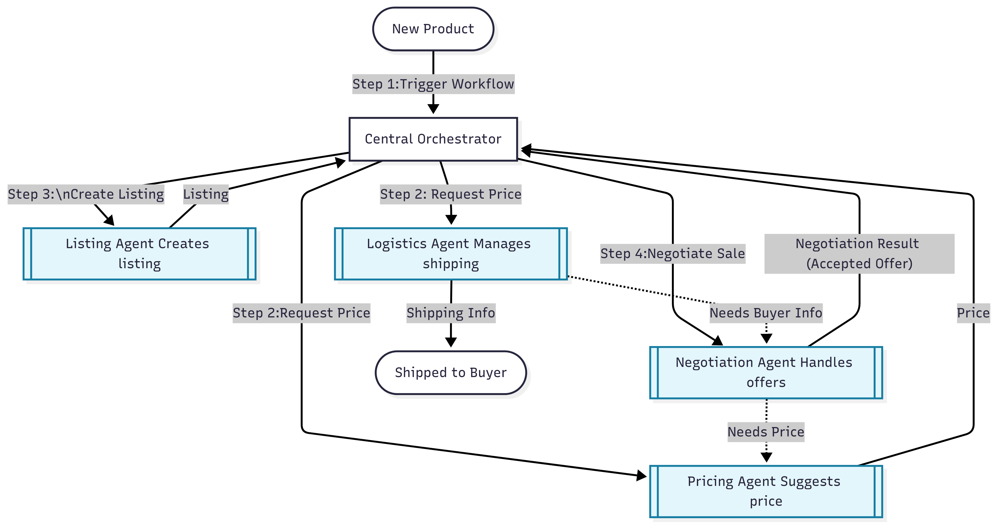
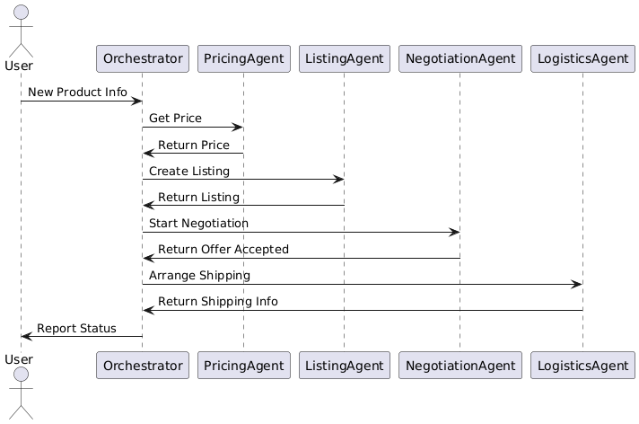

# AI Multi-Agent Orchestration System

---

## **Overview**

This project demonstrates a multi-agent orchestration system in Python using CrewAI-style patterns.  
It simulates a realistic e-commerce workflow: pricing, listing, negotiation, and logistics.  
**Key features:** modular agent design, clear task delegation, agent-to-agent communication, and robust error handling.

---

## **Project Structure**


ai-agent-orchestrator/
│
├── agents/
│ ├── pricing_agent.py
│ ├── listing_agent.py
│ ├── negotiation_agent.py
│ └── logistics_agent.py
├── orchestrator.py
├── main.py
├── README.md
├── .gitignore
├── mermaid.png
└── seq.png


---


---

## Task Requirements & How This Project Meets Them

| Requirement                           | Implementation Location   |
|----------------------------------------|--------------------------|
| Central AI Orchestrator                | `orchestrator.py` class  |
| 3-4 Specialized Agents                 | `agents/` (Pricing, Listing, Negotiation, Logistics) |
| Basic Communication Layer              | Orchestrator delegates & relays data between agents |
| Simple Data Flow Management            | Orchestrator runs workflow, passes results stepwise |
| Orchestrator delegates tasks (CrewAI)  | `delegate_task()` method in `orchestrator.py` |
| At least 2-3 agents, distinct roles    | `agents/pricing_agent.py`, etc.  |
| Inter-agent communication              | Negotiation ↔️ Pricing (min price retry)         |
| Error handling & task coordination     | If negotiation fails, shipping skipped; status logs |
| Clear system architecture & diagrams   | `mermaid.png`, `seq.png` in README               |

---

## Sample Output

[Orchestrator] Starting orchestration...
[Orchestrator] Delegating 'suggest_price' to PricingAgent
[PricingAgent] Suggested price for 'Surplus iPhone 12': $255.00
[Orchestrator] Delegating 'create_listing' to ListingAgent
[ListingAgent] Created listing: {'title': 'Surplus iPhone 12 (good)', ...}
[Orchestrator] Delegating 'handle_negotiation' to NegotiationAgent
[NegotiationAgent] Received offer: $204.00 for Surplus iPhone 12 (good) (asking: $255.00)
[NegotiationAgent] Offer accepted at $204.00!
[Orchestrator] Delegating 'arrange_shipping' to LogisticsAgent
[LogisticsAgent] Shipping arranged: {'recipient': 'John Doe', ...}
[Orchestrator] Task status summary: {'steps': ['pricing: success', 'listing: success', 'negotiation: success', 'logistics: shipped']}
[Orchestrator] Workflow complete.

Final Output: {'recipient': 'John Doe', ...}


## **How to Run**

1. **Clone the repository:**
    ```bash
    git clone https://github.com/yourusername/ai-agent-orchestrator.git
    cd ai-agent-orchestrator
    ```

2. **Set up the Python environment:**
    ```bash
    python -m venv venv
    source venv/bin/activate      # On Windows: venv\Scripts\activate
    ```

3. **Install dependencies:**
    ```bash
    pip install crewai
    ```

4. **Run the main script:**
    ```bash
    python main.py
    ```

---

## **System Architecture**

### 1. System Flowchart



**Description:**  
The flowchart above shows how the Central Orchestrator manages product info, delegates tasks to four specialized agents (Pricing, Listing, Negotiation, Logistics), and coordinates the sale and shipping workflow. Arrows indicate the main flow of data and control between agents and the orchestrator.

---

### 2. Sequence Diagram



**Description:**  
The sequence diagram shows the timing/order of each agent’s task.  
It visualizes how product info is routed from the user to the Orchestrator, which sequentially delegates to each agent, and finally reports status/results.

---

## **Agent Responsibilities**

| Agent               | Responsibility                                                  |
|---------------------|----------------------------------------------------------------|
| **PricingAgent**        | Suggests product price and minimum acceptable price.             |
| **ListingAgent**        | Creates product listing details (title, description, price).     |
| **NegotiationAgent**    | Handles simulated buyer offers and retries with a new price.     |
| **LogisticsAgent**      | Arranges shipping if a sale occurs.                             |

---

## **Key Features & CrewAI Principles**

- **Orchestrator delegates tasks** to specialized agents (CrewAI controller pattern).
- **Agents are modular** and have clearly defined roles.
- **Inter-agent communication:** Orchestrator enables agents to exchange data (e.g., NegotiationAgent can request a new price from PricingAgent).
- **Task coordination & error handling:** If negotiation fails, shipping is skipped; system is robust.
- **Professional diagrams** to explain architecture and data flow.

---

## **How to Customize or Extend**

- **Add more agent roles:** (e.g. Reporting, Compliance) by copying the agent pattern.
- **Enhance negotiation logic:** (multi-round, random, or AI-based).
- **Integrate with real APIs or data sources** for production use.

---

## **Author**

amine souissi  
*Built for SurplusLoop Technical Assessment*
